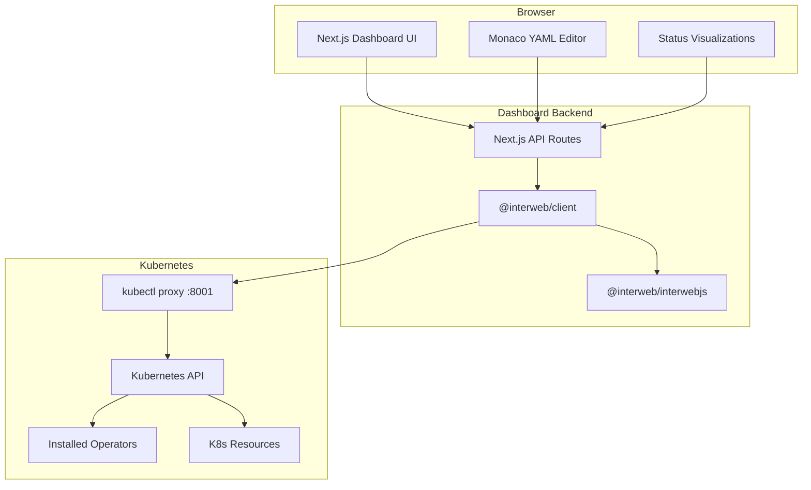

# Interweb Dashboard Specification

## Overview

The Interweb Dashboard is a web-based interface that provides a visual management layer for the Interweb Kubernetes toolkit. It exposes the functionality of the `@interweb/client` package through an intuitive UI, enabling operators installation, database management, secrets handling, and cluster visualization.

## Architecture

### Technology Stack
- **Framework**: Next.js 14 with App Router
- **Language**: TypeScript
- **UI Library**: Radix UI primitives with Tailwind CSS  
- **State Management**: TanStack Query (React Query)
- **Code Editor**: Monaco Editor (for YAML editing)
- **Icons**: Lucide React
- **API Integration**: Direct integration with `@interweb/client`

### System Architecture



## Core Features

### 1. Cluster Overview Dashboard
- **Cluster Status**: Health, nodes, resource utilization
- **Installed Operators**: Visual grid of installed/available operators
- **Resource Summary**: Pods, services, ingresses, databases count
- **Recent Activity**: Events and operations log
- **Quick Actions**: Common operations buttons

### 2. Operator Management
- **Operator Catalog**: Visual grid of available operators with descriptions
- **Installation Interface**: Toggle-based installation with options
- **Status Monitoring**: Real-time status of operator deployments
- **Version Management**: Upgrade/downgrade capabilities
- **Configuration**: Operator-specific settings

**Supported Operators** (from `@interweb/manifests`):
- ingress-nginx
- cert-manager  
- Knative Serving
- CloudNativePG
- kube-prometheus-stack

### 3. Database Operations (CloudNativePG Focus)
- **Cluster Management**: Create, scale, delete PostgreSQL clusters
- **Backup Operations**: Schedule, trigger, restore backups
- **Connection Management**: Generate connection strings, manage users
- **Monitoring**: Database metrics, replication status, performance
- **Configuration**: PostgreSQL settings, extensions, resource limits

### 4. Secrets Management
- **Secret Creation**: Form-based secret creation with validation
- **Secret Templates**: Pre-configured templates for common secrets
- **Encryption Status**: Visual indicators for encryption at rest
- **Access Control**: RBAC integration for secret access
- **Secret Rotation**: Automated rotation scheduling

### 5. Application Deployment
- **Deployment Wizard**: Step-by-step app deployment
- **Template Gallery**: Pre-built application templates
- **Resource Management**: CPU/memory allocation, scaling
- **Service Configuration**: Ingress, load balancer setup
- **Environment Management**: Multi-environment deployments

## User Interface Specification

### Layout Structure
```
┌─────────────────────────────────────────────────────┐
│ Header: Logo | Cluster Context | User Menu          │
├─────────────────────────────────────────────────────┤
│ Sidebar Navigation                                   │
│ ├── Dashboard                                       │
│ ├── Operators                                       │
│ ├── Databases                                       │
│ ├── Applications                                    │
│ ├── Secrets                                         │
│ ├── Monitoring                                      │
│ └── Settings                                        │
├─────────────────────────────────────────────────────┤
│                                                     │
│           Main Content Area                         │
│                                                     │
│                                                     │
└─────────────────────────────────────────────────────┘
```

### Page Specifications

#### 1. Dashboard Home (`/`)
- **Hero Section**: Cluster health overview with key metrics
- **Operator Grid**: 3x2 grid showing installed operators with status
- **Quick Actions**: Common operations (deploy app, create DB, manage secrets)
- **Recent Activity**: Timeline of recent operations and events
- **Resource Summary**: Charts showing resource utilization

#### 2. Operators Page (`/operators`)
- **Filter Toolbar**: Category, status, search filters
- **Operator Cards**: Each operator shown as a card with:
  - Icon and name
  - Installation status toggle
  - Quick info (version, resources)
  - Configure button
- **Installation Modal**: Operator-specific configuration options
- **Status Dashboard**: Real-time installation progress

#### 3. Database Operations (`/databases`)
- **Cluster List**: Table of PostgreSQL clusters with status
- **Create Cluster**: Form with configuration options:
  - Cluster name and namespace
  - PostgreSQL version
  - Replica count
  - Storage size and class
  - Resource limits
  - Backup configuration
- **Cluster Details**: Individual cluster management:
  - Overview tab: Status, connections, metrics
  - Backup tab: Backup management and restore
  - Configuration tab: PostgreSQL settings
  - Monitoring tab: Performance metrics and logs

#### 4. Secrets Management (`/secrets`)
- **Secret List**: Table of secrets with type, namespace, age
- **Create Secret**: Form-based creation with types:
  - Generic (key-value pairs)
  - Docker registry credentials
  - TLS certificates
  - Service account tokens
- **Secret Templates**: Pre-configured templates for:
  - Database connections
  - API keys
  - OAuth configurations
  - Certificate authorities

### Component Library

#### Core Components
- `OperatorCard`: Operator installation card with toggle
- `StatusIndicator`: Health status with colors and icons
- `ResourceMetrics`: Charts and gauges for resource usage
- `YAMLEditor`: Monaco-based YAML configuration editor
- `ProgressTracker`: Installation/operation progress indicator
- `ConfirmationDialog`: Confirmation dialogs with detailed information

#### Database Components
- `DatabaseClusterCard`: PostgreSQL cluster status card
- `BackupScheduler`: Backup configuration interface
- `ConnectionStringGenerator`: Generate and copy connection strings
- `DatabaseMetricsChart`: Performance monitoring charts

## API Integration

### Integration with @interweb/client

The dashboard will use Next.js API routes that wrap the existing `@interweb/client` functionality:

```typescript
// pages/api/operators/[operator].ts
import { SetupClient } from '@interweb/client';
import { ManifestLoader } from '@interweb/manifests';

export async function POST(request: Request) {
  const { operator, action } = await request.json();
  const client = new SetupClient(/* k8s client */);
  
  if (action === 'install') {
    const manifests = ManifestLoader.loadOperatorManifests(operator);
    await client.applyManifests(manifests);
  }
  
  return Response.json({ success: true });
}
```

### API Endpoints Structure

#### Operators
- `POST /api/operators/install` - Install operator
- `DELETE /api/operators/uninstall` - Uninstall operator
- `GET /api/operators/status` - Get all operators status
- `GET /api/operators/[name]/config` - Get operator configuration
- `PUT /api/operators/[name]/config` - Update operator configuration

#### Databases (CloudNativePG)
- `POST /api/databases/clusters` - Create PostgreSQL cluster
- `GET /api/databases/clusters` - List PostgreSQL clusters
- `GET /api/databases/clusters/[name]` - Get cluster details
- `PUT /api/databases/clusters/[name]` - Update cluster configuration
- `DELETE /api/databases/clusters/[name]` - Delete cluster
- `POST /api/databases/clusters/[name]/backup` - Trigger backup
- `GET /api/databases/clusters/[name]/backups` - List backups
- `POST /api/databases/clusters/[name]/restore` - Restore from backup

#### Secrets
- `POST /api/secrets` - Create secret
- `GET /api/secrets` - List secrets (filtered by namespace)
- `GET /api/secrets/[name]` - Get secret details
- `PUT /api/secrets/[name]` - Update secret
- `DELETE /api/secrets/[name]` - Delete secret
- `GET /api/secrets/templates` - Get secret templates

#### Cluster
- `GET /api/cluster/status` - Get cluster overview
- `GET /api/cluster/nodes` - Get node information
- `GET /api/cluster/resources` - Get resource utilization
- `GET /api/cluster/events` - Get recent events

## Configuration Management

### Dashboard Configuration
```yaml
# interweb-dashboard.config.yaml
cluster:
  proxyUrl: "http://localhost:8001"
  defaultNamespace: "default"

operators:
  enabledOperators:
    - ingress-nginx
    - cert-manager
    - knative-serving
    - cloudnative-pg
    - kube-prometheus-stack
  
database:
  defaultPostgresVersion: "16"
  defaultStorageClass: "standard"
  defaultBackupRetention: "30d"

ui:
  theme: "system" # light, dark, system
  refreshInterval: 30000 # ms
  
features:
  secretsManagement: true
  backupRestore: true
  monitoring: true
```

## Security Considerations

### Authentication & Authorization
- **No built-in auth**: Relies on kubectl proxy for K8s authentication
- **RBAC Integration**: Respects Kubernetes RBAC permissions
- **Secure Defaults**: Safe configuration defaults for all operations
- **Input Validation**: Comprehensive validation for all user inputs

### Data Protection
- **No Credential Storage**: Secrets are managed through Kubernetes API only
- **Audit Logging**: All operations logged for audit trail
- **Secure Communication**: HTTPS enforcement in production
- **CSRF Protection**: Built-in CSRF protection for all mutations

## Development Phases

### Phase 1: Core Infrastructure (Week 1-2)
- [ ] Next.js project setup with TypeScript
- [ ] Basic layout and navigation
- [ ] Integration with @interweb/client
- [ ] Cluster status dashboard
- [ ] Operator list and status view

### Phase 2: Operator Management (Week 3-4)
- [ ] Operator installation interface
- [ ] Installation progress tracking
- [ ] Basic operator configuration
- [ ] Status monitoring and health checks

### Phase 3: Database Operations (Week 5-6)
- [ ] CloudNativePG integration
- [ ] PostgreSQL cluster creation form
- [ ] Cluster management interface
- [ ] Basic backup operations
- [ ] Connection string generation

### Phase 4: Secrets Management (Week 7)
- [ ] Secret creation forms
- [ ] Secret templates
- [ ] Secret listing and management
- [ ] Validation and error handling

### Phase 5: Enhancement & Polish (Week 8)
- [ ] Monitoring dashboards
- [ ] Performance optimizations
- [ ] Error handling improvements
- [ ] Documentation and testing

## Success Metrics

### Functional Requirements
- [ ] All operators can be installed/uninstalled via toggle interface
- [ ] PostgreSQL clusters can be created and managed completely through UI
- [ ] Secrets can be created and managed without kubectl
- [ ] All operations provide clear feedback and error handling
- [ ] Dashboard works with different Kubernetes distributions (kind, k3s, EKS, etc.)

### Performance Requirements
- [ ] Initial load time < 3 seconds
- [ ] Operation feedback < 500ms
- [ ] Real-time status updates every 30 seconds
- [ ] Support for clusters with 100+ resources
- [ ] Responsive design for tablet and desktop

This specification provides a comprehensive foundation for building the Interweb Dashboard that meets your requirements while maintaining the architectural principles established by the hyperweb-io/dashboard project.
