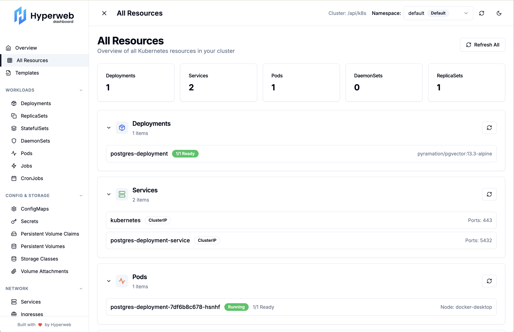

# Hyperweb Dashboard

<p align="center" width="100%">
   <br />
</p>

A modern, React-based dashboard for interacting with Kubernetes clusters, powered by Hyperweb. Provides an intuitive UI to view and manage resources like pods, deployments, services, and more.

<p align="center" width="100%">
   
</p>

## Table of Contents

- [Features](#features)
- [Prerequisites](#prerequisites)
- [Installation](#installation)
- [Usage](#usage)
- [Available Scripts](#available-scripts)
- [Contributing](#contributing)
- [Credits](#credits)
- [License](#license)

## Features

- Browse and manage Kubernetes resources (Deployments, ReplicaSets, StatefulSets, DaemonSets, Pods, Jobs, etc.)
- Real-time updates via `kubectl proxy`
- Light/dark theme support
- Responsive sidebar navigation
- Modular and extensible React components

## Prerequisites

- Node.js (v14 or higher)
- Yarn (v1.22 or higher)
- A running Kubernetes cluster
- `kubectl` CLI installed and configured

## Installation

1. Clone the repository:
   ```bash
   git clone https://github.com/hyperweb-io/dashboard.git
   ```
2. Navigate to the React package:
   ```bash
   cd dashboard/
   ```
3. Install dependencies:
   ```bash
   yarn install
   ```

## Usage

1. Start the Kubernetes API proxy to allow local access:
   ```bash
   kubectl proxy --port=8001 --accept-hosts='^.*$' --address='0.0.0.0'
   ```
2. Run the development server:
   ```bash
   yarn dev
   ```
3. Open your browser and go to [http://localhost:3000](http://localhost:3000)

## Available Scripts

- `yarn dev` - Run the app in development mode
- `yarn build` - Build the app for production
- `yarn start` - Start the production build
- `yarn lint` - Run linter checks

## Contributing

Contributions are welcome! Feel free to open issues or submit pull requests on the [GitHub repository](https://github.com/hyperweb-io/dashboard).

## Credits

🛠 Built by Hyperweb — if you like our tools, please check out and contribute to [our GitHub ⚛️](https://github.com/hyperweb-io).

## Disclaimer

AS DESCRIBED IN THE LICENSES, THE SOFTWARE IS PROVIDED "AS IS", AT YOUR OWN RISK, AND WITHOUT WARRANTIES OF ANY KIND.

No developer or entity involved in creating this software will be liable for any claims or damages whatsoever associated with your use, inability to use, or your interaction with other users of the code, including any direct, indirect, incidental, special, exemplary, punitive or consequential damages, or loss of profits, cryptocurrencies, tokens, or anything else of value.
